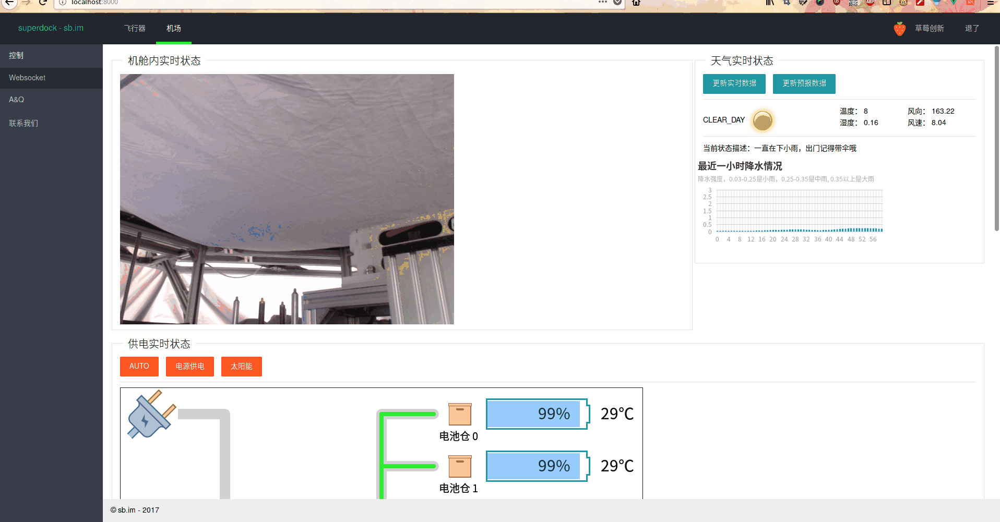
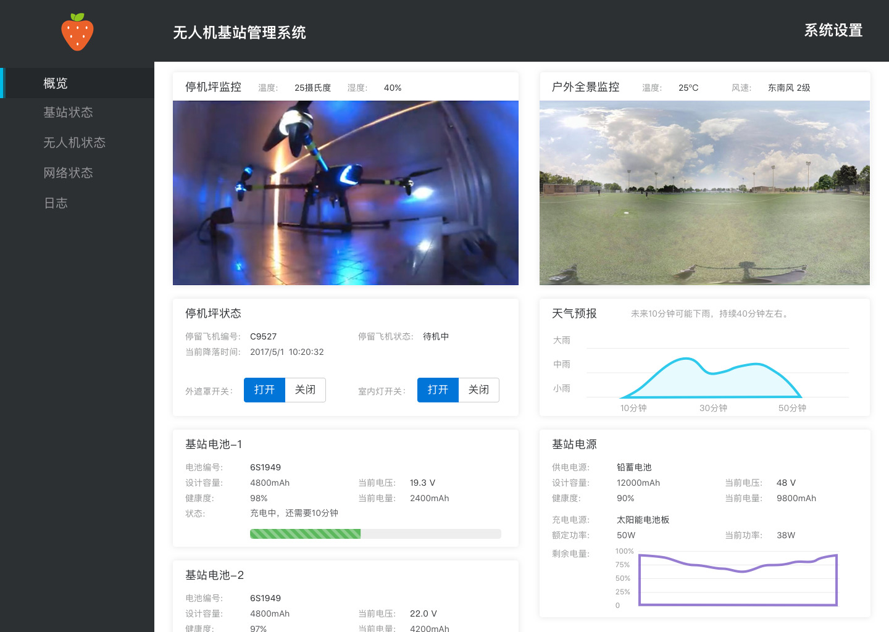

SDWC v3.0 == SuperDock Web Console
=====

> A Vue.js project
>
> element-ui


## Config

config.json


## Build Setup

``` bash
# install dependencies
yarn install

# serve with hot reload at localhost:8080
yarn run dev

# build for production with minification
yarn run build
```

For detailed explanation on how things work, consult the [docs for vue-loader](http://vuejs.github.io/vue-loader).


## Todo List
- [ ] English Doc
- [ ] add flv.js
- [ ] mavlink components

## 中文文档
本程序使用 vue 全家桶 + element-ui + axios.js 开发

本程序可以实现同时控制多台设备

有些东西不知道如何中描述～ (￣∇￣) ～ 请参上面的英文文档

##### 程序框架父子组件关系图

* app
  - login
  - dashboard
    - header
    - sidemenu
    - tabs
      - context

程序启动默认加载 / 目录下的 config.json 配置文件

```
cp src/config.json ./

```

如果没找到文件，默认启本文件加载 samples 目录下的数据（本地数据）

这样可以启用本地调试账号

>user: debug
>
>pass: debug

## 关于token 认证
目前只支持在url里埋token方式

1. 在suffix 变量里设置好token变量名
2. 在login 返回json 中设置 url_token 参数为 true
3. token 值会自动加在 suffix 后面，每次请求会自动添加token


### 生命周期异步资源加载过程
1. load config.json
2. auth user [post && get]
3. get nodes list
4. get node detail && link node

### 目录模块

##### samples
提供本地数据，异步请求数据样本

##### contexts
内容模目录

提供两个内容模型
- contexts
  - air
  - depot

调用 components 里模块

##### components
功能组件
- components
  - webterminal
    - command.json
  - monitor-img

#### old
old 目录下的是 2.0 版本程序 （已废弃）可以拿来做参考～ (・∀・) ～



v 1.0 纯图片


